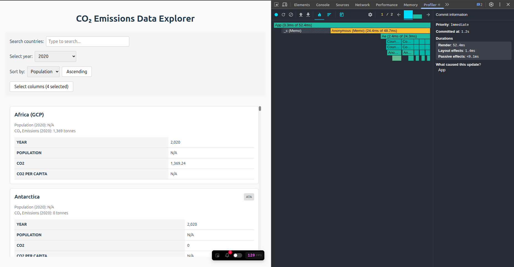
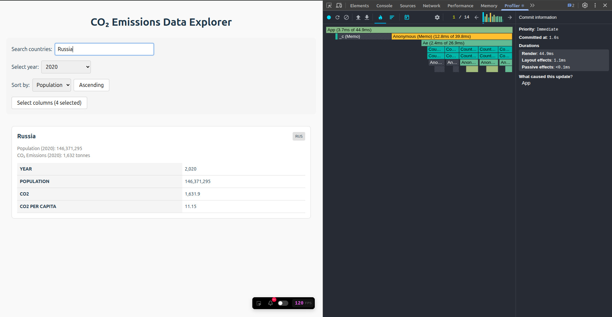
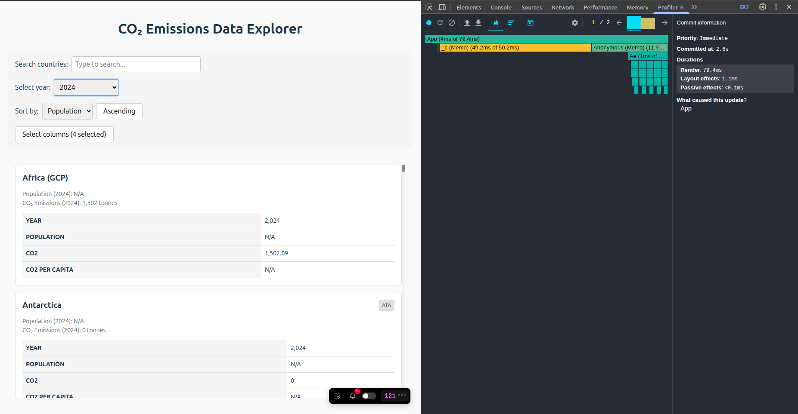
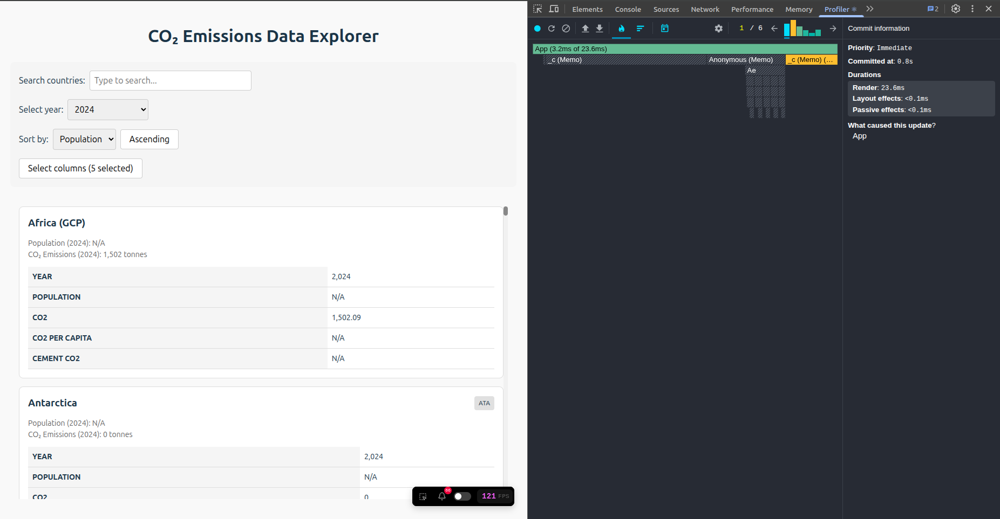

# Performance

## Initial

### Sorting countries

- **Render duration**: 599.8ms
- **Flame chart** 

### Searching for a country

- **Render duration**: 381.4ms
- **Flame chart** 

### Selecting a different year

- **Render duration**: 655.7ms
- **Flame chart** 

### Toggling columns

- **Render duration**: 573.8ms
- **Flame chart** 

## Final

### Sorting countries

- **Render duration**: 52.4ms
- **Flame chart** 

### Searching for a country

- **Render duration**: 44.9ms
- **Flame chart** 

### Selecting a different year

- **Render duration**: 79.4ms
- **Flame chart** 

### Toggling columns

- **Render duration**: 23.6ms
- **Flame chart** 

### Improvements

- **Sorting countries**: 599.8ms => 52.4ms (91,3%)
- **Searching for a country**: 381.4ms => 44.9ms (88,2%)
- **Selecting a different year**: 655.7ms => 79.4ms (87,9%)
- **Toggling columns**: 573.8ms => 23.6ms (95,9%)
